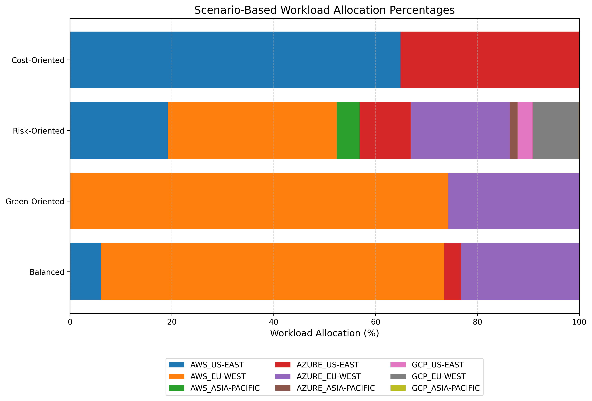
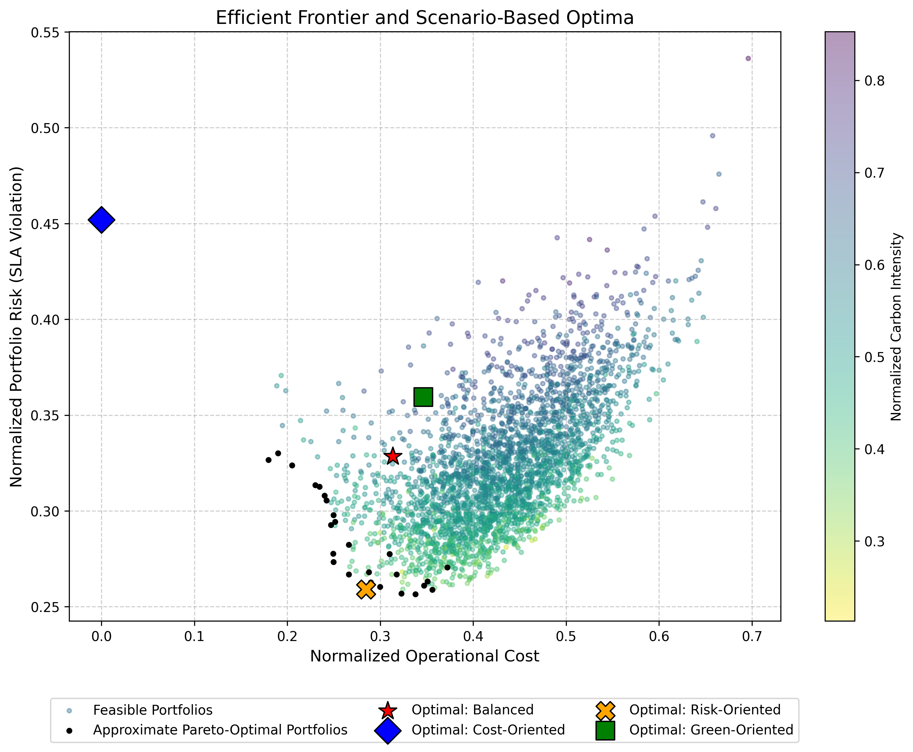

<div align="center">
  <h1>Multi-Cloud Resource Allocation with Modern Portfolio Theory</h1>
  <p><strong>A thesis-faithful Python implementation for multi-objective cloud workload allocation across cost, SLA reliability risk, and carbon sustainability.</strong></p>
  <p><sub>Bachelor's Thesis &bull; Yildiz Technical University &bull; 2026</sub></p>
  <p>
    
    
    <a href="LICENSE"></a>
  </p>
</div>

## Overview

This repository contains the Python implementation developed for the bachelor's thesis
**“Multi-Objective Optimization of Multi-Cloud Resource Allocation Using Modern
Portfolio Theory: Balancing Cost, Availability, and Sustainability.”** The model treats
each cloud provider-region pair as a portfolio asset and uses constrained optimization to
allocate a static workload across AWS, Microsoft Azure, and Google Cloud Platform.

The implementation evaluates three competing criteria:

- normalized hourly operational cost;
- covariance-based SLA reliability risk;
- normalized regional carbon intensity.

The project is an academic simulation and decision-support reference. It is not a live
cloud scheduler, pricing calculator, outage predictor, or complete carbon-accounting
system.

## Highlights

- Reproduces the published scenario scores and workload allocations from Thesis Tables
  5.2 and 5.3.
- Preserves the archived mathematical model, covariance behavior, weighted-sum
  formulation, and SLSQP configuration.
- Validates source data, model inputs, optimization results, and generated artifacts.
- Produces deterministic visualizations using normalized-uniform portfolio sampling and
  seed `42`.
- Includes regression, validation, visualization, and external-entry-point tests using
  Python's standard-library `unittest` framework.

## Results at a glance

### Scenario workload allocations



### Efficient frontier and scenario optima



### Published regression targets

| Scenario | Cost score | Risk score | Carbon score |
|---|---:|---:|---:|
| Cost-Oriented | 0.0000 | 0.4520 | 0.6250 |
| Risk-Oriented | 0.2845 | 0.2590 | 0.2624 |
| Green-Oriented | 0.3463 | 0.3594 | 0.0000 |
| Balanced | 0.3135 | 0.3284 | 0.0589 |

The test suite also protects all 36 allocation percentages from Table 5.3 and the exact
simplified covariance behavior.

## Quick start

Python 3.11 is the tested runtime.

Create a virtual environment:

```bash
python -m venv .venv
```

Activate the environment on Windows:

```powershell
.\.venv\Scripts\Activate.ps1
```

Or on macOS/Linux:

```bash
source .venv/bin/activate
```

Install the pinned dependencies:

```bash
python -m pip install -r requirements.txt
```

Run the complete analysis from the repository directory:

```bash
python main.py
```

Paths are resolved relative to `main.py`, so the same entry point can also be invoked
from another working directory. The analysis saves all artifacts in `outputs/`.
Interactive plot display is skipped automatically when Matplotlib uses a headless backend.

The random feasible-portfolio simulation retains the thesis implementation's
normalized-uniform sampling procedure and uses seed `42` for reproducibility.

## Academic fidelity

The published thesis results are the governing regression targets for this repository.
The implementation preserves the original dataset, normalization, covariance construction,
weighted-sum objective, SLSQP configuration, scenario definitions, and output formatting
needed to reproduce Tables 5.2 and 5.3.

### Thesis Table 3.1 inconsistency

Thesis Table 3.1 describes a richer correlation structure with coefficients `0.60`,
`0.30`, and `0.10`. That structure was not used to produce the published scenario
results. The archived implementation, covariance artifact, Tables 5.2–5.3, and their
corresponding discussion instead use the following simplified behavior:

- an asset has self-correlation `1.0`;
- distinct provider-region assets in the same region have correlation `0.4`;
- all other off-diagonal pairs have correlation `0`.

This repository intentionally preserves the archived implementation because it is the
configuration that reproduces the published results. Table 3.1 is therefore documented as
an unresolved internal inconsistency in the thesis, not as the implemented covariance
configuration.

## Mathematical model

For `n` provider-region assets, `w_i` is the proportion of workload assigned to asset
`i`. Allocations are long-only and fully invested:

```text
sum(w_i) = 1
0 <= w_i <= 1
```

Hourly cost and carbon intensity are scaled independently with Min-Max normalization:

```text
x_normalized = (x - min(x)) / (max(x) - min(x))
```

If all observations for a metric are identical, its normalized value is defined as zero,
matching the archived implementation.

The covariance matrix is constructed from the scenario-based SLA risk indicators `r_i`
and the implemented correlations `rho_ij`:

```text
sigma_ij = rho_ij * r_i * r_j
```

Portfolio risk is the normalized portfolio standard deviation:

```text
raw_risk = sqrt(w^T * Sigma * w)
risk_score = raw_risk / max(r_i)
```

The global objective minimized by SLSQP is:

```text
F(w) = alpha * cost_score
     + beta  * risk_score
     + gamma * carbon_score
```

The preference coefficients are nonnegative and sum to one.

### Scenarios

| Scenario | Alpha: cost | Beta: risk | Gamma: carbon |
|---|---:|---:|---:|
| Cost-Oriented | 0.80 | 0.10 | 0.10 |
| Risk-Oriented | 0.10 | 0.80 | 0.10 |
| Green-Oriented | 0.10 | 0.10 | 0.80 |
| Balanced | 0.33 | 0.33 | 0.34 |

## Data and provenance

The source CSV, [`data/cloud_pricing.csv`](data/cloud_pricing.csv), contains one
standardized compute alternative for every provider-region pair.

| Column | Meaning | Unit |
|---|---|---|
| `provider` | Cloud provider | categorical |
| `region` | Geographic region | categorical |
| `instance_type` | Representative general-purpose VM | provider-specific identifier |
| `hourly_cost` | On-demand compute price used by the simulation | USD per hour |

During preprocessing, the application adds:

| Column | Meaning | Unit |
|---|---|---|
| `sla_risk` | Scenario-based relative service-reliability indicator | dimensionless |
| `carbon_intensity` | Regional electricity carbon intensity benchmark | gCO2e/kWh |

The SLA risk values are controlled simulation parameters, not empirically estimated outage
probabilities. Carbon intensity is an environmental proxy; the model does not calculate
workload energy consumption or complete lifecycle emissions.

The thesis cites the following primary data and methodology references, accessed on
March 28, 2026:

- [AWS EC2 On-Demand Pricing](https://aws.amazon.com/ec2/pricing/on-demand/)
- [Azure Virtual Machines Pricing](https://azure.microsoft.com/en-us/pricing/details/virtual-machines/)
- [Google Compute Engine VM Pricing](https://cloud.google.com/compute/vm-instance-pricing)
- [AWS Compute SLA](https://aws.amazon.com/compute/sla/)
- [Azure Online Services SLA](https://www.microsoft.com/licensing/docs/view/Service-Level-Agreements-SLA-for-Online-Services)
- [Google Compute Engine SLA](https://cloud.google.com/compute/sla)
- [Electricity Maps Methodology](https://www.electricitymaps.com/data/methodology)
- [Cloud Carbon Footprint Methodology](https://www.cloudcarbonfootprint.org/docs/methodology/)

The repository contains the fixed values used in the thesis; it does not retrieve current
prices, outages, or electricity-grid data.

## Repository structure

```text
.
├── data/
│   └── cloud_pricing.csv
├── docs/
│   └── ahmet-tugrul-aki-bachelors-thesis.pdf
├── outputs/
│   ├── covariance_matrix.csv
│   ├── efficient_frontier.png
│   ├── scenario_allocation_results.csv
│   ├── scenario_performance_scores.csv
│   └── scenario_workload_allocation.png
├── src/
│   ├── __init__.py
│   └── multi_cloud_allocation/
│       ├── __init__.py
│       ├── data_loader.py          Loads, validates, normalizes names, and enriches input data
│       ├── optimizer.py            Defines canonical scenarios and runs constrained SLSQP
│       ├── paths.py                Defines repository-relative data and output paths
│       ├── portfolio_engine.py     Constructs covariance and evaluates portfolio metrics
│       └── visualizer.py           Generates allocation and efficient-frontier figures
├── tests/
│   ├── __init__.py
│   ├── test_thesis_regression.py
│   ├── test_validation.py
│   └── test_visualization.py
├── .gitignore
├── LICENSE
├── main.py                         Runs the complete thesis analysis
├── README.md
└── requirements.txt
```

## Generated artifacts

| File | Description |
|---|---|
| `outputs/covariance_matrix.csv` | Implemented covariance matrix in provider-region order |
| `outputs/scenario_performance_scores.csv` | Table 5.2 normalized scenario scores |
| `outputs/scenario_allocation_results.csv` | Table 5.3 workload allocation percentages |
| `outputs/scenario_workload_allocation.png` | Scenario allocation visualization corresponding to Figure 5.1 |
| `outputs/efficient_frontier.png` | Deterministic feasible portfolio cloud and scenario optima |

## Testing

Run all tests from the repository directory:

```bash
python -m unittest discover -v
```

The suite contains 27 regression, validation, visualization, and integration tests. They
cover published results, covariance construction, objectives, constraints, invalid input,
optimizer failures, deterministic simulation, figure generation, generated CSVs, and
execution from an external working directory.

## Limitations

The implementation intentionally retains the scope described in the thesis:

- fixed scenario-based SLA risk indicators and correlation assumptions;
- static workload allocation rather than real-time scheduling;
- three providers, three regions, and one representative compute instance per pair;
- regional carbon intensity as a proxy rather than complete carbon accounting;
- no latency, storage, networking, data-transfer, compliance, or financial-risk model;
- weighted-sum scenario solutions rather than a complete evolutionary Pareto frontier.

These limitations are part of the academic model and are not silently replaced with more
complex assumptions.

## Thesis citation

Ahmet Tuğrul Aki, *Multi-Objective Optimization of Multi-Cloud Resource Allocation
Using Modern Portfolio Theory: Balancing Cost, Availability, and Sustainability*,
Bachelor's Thesis, Department of Mathematical Engineering, Yıldız Technical University,
Istanbul, 2026.

The [complete bachelor's thesis](docs/ahmet-tugrul-aki-bachelors-thesis.pdf) is available
in the `docs/` directory.

## License

This project is available under the [MIT License](LICENSE).
